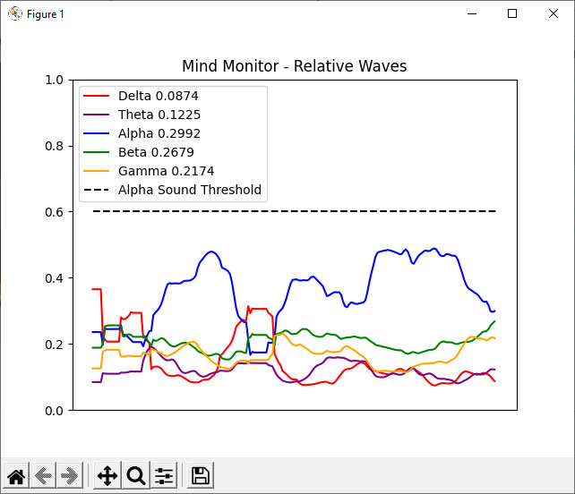

# Mind Monitor Python EEG Analysis System
Advanced real-time EEG consciousness monitoring and therapeutic pattern detection

This system provides professional-grade signal processing and therapeutic pattern analysis for live brainwave data from Mind Monitor (connected to a Muse device). Features include clinical EEG band analysis, Internal Family Systems parts detection, meditation state monitoring, and nervous system regulation assessment.

## Usage

### Setup
```bash
# Install dependencies
uv sync
```

### Components

## [OSC Receiver.py](OSC%20Receiver.py)
* Records RAW EEG to a CSV file.
* Marker #1 starts recording. Marker #2 stops recording.
```bash
uv run python "OSC Receiver.py"
```

## [consciousness_monitor/](consciousness_monitor/) - **RECOMMENDED**
**Modular consciousness monitoring system** with professional-grade signal processing and therapeutic pattern detection.

### Features
- **Clinical EEG Analysis**: Delta, Theta, Alpha, Beta, Gamma band analysis  
- **Therapeutic Patterns**: Jhana states, Internal Family Systems parts detection, startle responses
- **Real-time Processing**: 0.75-1.0 second windows with optimal signal preservation
- **Configuration-Driven**: External JSON rules for easy customization
- **Artifact Filtering**: Multi-band spike detection, impossible combinations, extreme shifts

### Usage
```bash
# Enhanced therapeutic monitoring (recommended)
uv run python consciousness_monitor.py --konrad-mode
uv run python -m consciousness_monitor --konrad-mode

# Basic consciousness monitoring
uv run python consciousness_monitor.py
uv run python -m consciousness_monitor

# Debug mode to see rule evaluation
uv run python consciousness_monitor.py --debug --konrad-mode

# Custom parameters (example: 5 second window, 5 second updates)
uv run python consciousness_monitor.py --window 5 --update 5

# Analyze recorded session with therapeutic patterns
uv run python consciousness_monitor.py --analyze --file "recording.csv" --konrad-mode

# Tune detection thresholds without code changes
uv run python consciousness_monitor.py --tune-rule jhana.alpha_min=85

# Load custom rule sets
uv run python consciousness_monitor.py --load-rules my_therapeutic_rules.json
```

### Detected States
- **Therapeutic Patterns**: JHANA/TRANSCENDENT, YOUNG PART CONNECTED, HOPEFUL PART ACTIVE, SECURITY GUARD ACTIVE
- **Standard Patterns**: RELAXED, FOCUSED, CREATIVE/FLOW, MEDITATIVE, DROWSY, PEAK FOCUS, ALERT/TENSE

## [realtime_consciousness_analyzer.py](realtime_consciousness_analyzer.py)
* Basic real-time consciousness monitoring
```bash
uv run python realtime_consciousness_analyzer.py
```

## [OSC Receiver Audio Feedback.py](OSC%20Receiver%20Audio%20Feedback.py)

* Calculates and graphs the relative waves.
* Plays a sound file if Alpha relative reaches a pre-set threshold.
* Displays if the headband is correctly fitted in the console.

## [OSC Receiver Simple.py](OSC%20Receiver%20Simple.py)
* Displays RAW EEG.

## Architecture

### Modular Design
The consciousness monitor is organized as a Python package with clear separation of concerns:

```
consciousness_monitor/
├── main.py                    # Core orchestration (540 lines vs. original 2527)
├── config/                    # Configuration management
│   ├── detection_rules.json  # Therapeutic pattern rules
│   ├── sub_states.json       # Sub-state definitions  
│   └── *.py                  # Rule/threshold managers
├── data/                     # Data processing & parsing
├── detection/                # Pattern detection & analysis
├── ui/                      # Display & user interface
└── utils/                   # Mathematical helpers
```

### Benefits
- **18 focused modules** instead of 1 monolithic file
- Each module **<300 lines** with clear responsibility  
- **Maintainable** with clean interfaces between components
- **Extensible** architecture for adding new features
- **Backward compatible** - all existing functionality preserved

### Technical Details
- **Sample Rate**: 256 Hz (Muse standard)
- **Window Size**: 0.75-1.0 seconds (optimal for Mind Monitor)
- **Preprocessing**: DC removal only (preserves alpha waves)
- **Frequency Bands**: Delta (0.5-4Hz), Theta (4-8Hz), Alpha (8-13Hz), Beta (13-30Hz), Gamma (30-50Hz)
- **Data Format**: CSV with TimeStamp, RAW_TP9, RAW_AF7, RAW_AF8, RAW_TP10, AUX channels